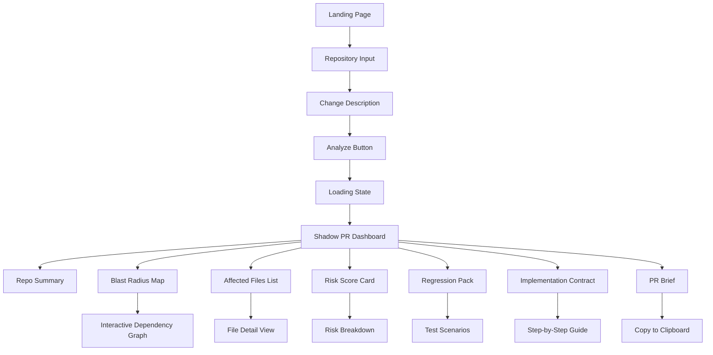

# RepoTwin by Bob - Hackathon Implementation Plan

## Product Summary

**RepoTwin by Bob** is a digital twin platform that simulates the impact of proposed code changes before implementation. It transforms vague change requests into comprehensive impact analyses, showing developers the "blast radius" of their changes across the entire codebase.

**Core Value Proposition:**
- Prevents costly mistakes by revealing hidden dependencies
- Reduces code review time by pre-analyzing impacts
- Accelerates onboarding by visualizing codebase relationships
- Demonstrates IBM Bob's ability to understand complex codebases

**Target User:** Mid-to-senior developers working on established codebases who need to understand change impacts before writing code.

---

## MVP Scope

### What We're Building (48-Hour Realistic Scope)

**Core Experience:**
1. **Input Screen:** Developer describes a proposed change in natural language
2. **Analysis Loading:** Visual feedback showing IBM Bob "thinking"
3. **Shadow PR Dashboard:** Comprehensive impact report with 8 key sections
4. **Interactive Exploration:** Click through affected files, view risk scores, explore dependencies

**Demo Data:**
- Pre-built JSON response for "Add reservation flow before purchase" in UniMarket
- 2-3 additional example scenarios (optional, time permitting)
- Real-looking repository structure and file relationships

**Technical Stack:**
- Next.js 14 (App Router)
- TypeScript (strict mode)
- Tailwind CSS + shadcn/ui components
- Local JSON data (no backend initially)
- Optional: IBM Bob API integration if time permits

---

## Demo Story

### The Narrative Arc

**Act 1: The Problem (30 seconds)**
- Developer opens RepoTwin
- Sees UniMarket repository loaded
- Types: "Add reservation flow before purchase"
- Clicks "Analyze Impact"

**Act 2: The Analysis (15 seconds)**
- Loading animation shows IBM Bob analyzing
- Progress indicators: "Scanning dependencies...", "Mapping data flows...", "Calculating risk..."

**Act 3: The Revelation (2-3 minutes)**
- Shadow PR dashboard reveals the change affects 23 files across 6 modules
- Risk score: 7.2/10 (High) - not a simple change!
- Blast radius map shows cascading impacts:
  - Listing model needs new `reservationStatus` field
  - Transaction API requires 3 new endpoints
  - Android UI needs reservation confirmation screen
  - Payment flow must handle reservation holds
  - Analytics needs 5 new tracking events
  - Offline sync logic must handle reservation states
  - 12 existing tests will break
  - 8 new test scenarios required

**Act 4: The Value (30 seconds)**
- Developer sees "Safe Implementation Contract" with step-by-step guidance
- Regression test pack auto-generated
- PR brief ready to share with team
- Estimated implementation time: 3-4 days (not 1 day as initially thought)

**Key Insight:** What seemed like a simple feature is actually a complex cross-cutting change. RepoTwin revealed this BEFORE any code was written.

---

## User Flow



### Detailed Flow

1. **Landing Page** (5 seconds)
   - Hero section explaining RepoTwin
   - "Try Demo" button
   - Shows IBM Bob branding

2. **Repository Input** (10 seconds)
   - Pre-filled with "UniMarket" (demo mode)
   - Option to paste GitHub URL (future feature)
   - "Continue" button

3. **Change Description** (15 seconds)
   - Large text area: "Describe your proposed change..."
   - Example suggestions visible
   - Pre-filled demo: "Add reservation flow before purchase"
   - "Analyze Impact" primary CTA

4. **Loading State** (3-5 seconds)
   - Animated IBM Bob logo
   - Progress messages:
     - "Analyzing repository structure..."
     - "Mapping dependencies..."
     - "Calculating blast radius..."
     - "Generating impact report..."

5. **Shadow PR Dashboard** (main experience)
   - Top: Change summary card
   - 8 sections in organized layout
   - Sidebar navigation
   - Export/Share options

---

## App Screens

### 1. Landing Page (`/`)
**Purpose:** Hook judges immediately with clear value prop

**Layout:**
- Hero section with animated gradient background
- Headline: "See the blast radius before you code"
- Subheadline: "RepoTwin by IBM Bob simulates code changes before implementation"
- Demo CTA button (primary)
- 3 value props with icons:
  - "Prevent Breaking Changes"
  - "Accelerate Code Reviews"
  - "Onboard Faster"
- IBM Bob logo/branding footer

### 2. Demo Input Page (`/demo`)
**Purpose:** Collect change description, set context

**Layout:**
- Repository card (pre-filled: UniMarket)
- Large textarea for change description
- Example prompts (clickable):
  - "Add reservation flow before purchase"
  - "Migrate from REST to GraphQL"
  - "Add real-time notifications"
- "Analyze Impact" button (disabled until text entered)
- Powered by IBM Bob badge

### 3. Loading State (`/demo/analyzing`)
**Purpose:** Build anticipation, show AI at work

**Layout:**
- Centered loading animation
- IBM Bob logo pulsing
- Progress messages cycling every 1.5s
- Subtle particle effects
- "This usually takes 5-10 seconds..." hint

### 4. Shadow PR Dashboard (`/demo/results`)
**Purpose:** Main showcase - comprehensive impact analysis

**Layout:**
```
┌─────────────────────────────────────────────────────┐
│ Header: UniMarket > Add Reservation Flow            │
│ Risk Score: 7.2/10 (High) | 23 Files | 6 Modules   │
└─────────────────────────────────────────────────────┘
┌──────────┬──────────────────────────────────────────┐
│ Sidebar  │ Main Content Area                        │
│          │                                          │
│ • Summary│ ┌────────────────────────────────────┐  │
│ • Blast  │ │ Section Content (tabs/cards)       │  │
│ • Files  │ │                                    │  │
│ • Risk   │ │                                    │  │
│ • Tests  │ │                                    │  │
│ • Guide  │ │                                    │  │
│ • PR     │ │                                    │  │
│          │ └────────────────────────────────────┘  │
│ Export   │                                          │
└──────────┴──────────────────────────────────────────┘
```

#### 4a. Repo Summary Section
- Repository stats (files, languages, size)
- Key modules identified
- Architecture type (monorepo, microservices, etc.)
- Tech stack detected

#### 4b. Blast Radius Map Section
- Interactive dependency graph (using react-flow or similar)
- Color-coded nodes by impact level:
  - Red: Critical changes required
  - Orange: Moderate changes
  - Yellow: Minor updates
  - Green: No changes needed
- Hover shows file details
- Click to navigate to file view

#### 4c. Affected Files Section
- Grouped by module/directory
- Each file shows:
  - File path
  - Impact level badge
  - Change type (modify, create, delete)
  - Lines affected estimate
  - Reason for impact
- Expandable to show specific changes needed

#### 4d. Risk Score Card Section
- Overall risk score (0-10) with visual gauge
- Risk breakdown:
  - Data model changes (High)
  - API contract changes (High)
  - UI/UX changes (Medium)
  - Test coverage gaps (Medium)
  - Documentation needs (Low)
- Risk mitigation suggestions

#### 4e. Regression Pack Section
- Auto-generated test scenarios
- Grouped by category:
  - Unit tests needed
  - Integration tests needed
  - E2E scenarios
  - Edge cases to consider
- Each with description and priority

#### 4f. Safe Implementation Contract Section
- Step-by-step implementation guide
- Ordered by dependency (what must be done first)
- Each step shows:
  - Task description
  - Affected files
  - Estimated time
  - Dependencies
  - Validation criteria
- Checkbox UI (for visual appeal)

#### 4g. PR Brief Section
- Auto-generated PR description
- Includes:
  - Change summary
  - Impact analysis
  - Testing checklist
  - Reviewer notes
  - Breaking changes warning
- "Copy to Clipboard" button
- Markdown formatted

---

## Component Architecture

### Core Components

#### Layout Components
```typescript
// app/layout.tsx
- RootLayout: Global layout with IBM Bob branding
- Navigation: Top nav with logo and links
- Footer: IBM Bob attribution

// app/components/layout/
- Sidebar.tsx: Dashboard navigation
- Header.tsx: Page headers with breadcrumbs
- Container.tsx: Responsive content wrapper
```

#### Page Components
```typescript
// app/page.tsx
- LandingHero: Hero section with CTA
- ValuePropositions: 3-column feature grid
- DemoPreview: Screenshot/video of demo

// app/demo/page.tsx
- RepositoryInput: Repo selection/input
- ChangeDescriptionInput: Large textarea with examples
- ExamplePrompts: Clickable example changes

// app/demo/analyzing/page.tsx
- LoadingAnimation: IBM Bob logo animation
- ProgressMessages: Cycling status messages

// app/demo/results/page.tsx
- DashboardLayout: Main results layout
- SectionTabs: Navigation between sections
```

#### Feature Components
```typescript
// app/components/shadow-pr/
- RepoSummaryCard.tsx: Repository overview
- BlastRadiusGraph.tsx: Interactive dependency graph
- AffectedFilesList.tsx: Grouped file list with impacts
- RiskScoreGauge.tsx: Visual risk score display
- RiskBreakdown.tsx: Detailed risk factors
- RegressionTestList.tsx: Test scenarios list
- ImplementationSteps.tsx: Step-by-step guide
- PRBriefCard.tsx: Generated PR description

// app/components/ui/ (shadcn/ui)
- Button.tsx
- Card.tsx
- Badge.tsx
- Tabs.tsx
- Progress.tsx
- Tooltip.tsx
- Dialog.tsx
- Accordion.tsx
```

#### Utility Components
```typescript
// app/components/shared/
- LoadingSpinner.tsx
- ErrorBoundary.tsx
- CopyButton.tsx
- ExportButton.tsx
- IBMBobBadge.tsx
- RiskBadge.tsx
- ImpactBadge.tsx
```

---

## TypeScript Data Models

```typescript
// types/shadow-pr.ts

export type RiskLevel = 'low' | 'medium' | 'high' | 'critical';
export type ImpactLevel = 'none' | 'minor' | 'moderate' | 'major' | 'critical';
export type ChangeType = 'create' | 'modify' | 'delete' | 'rename';
export type FileCategory = 'model' | 'api' | 'ui' | 'test' | 'config' | 'docs';

export interface Repository {
  name: string;
  url?: string;
  description: string;
  stats: {
    totalFiles: number;
    totalLines: number;
    languages: Record<string, number>; // language -> percentage
    modules: string[];
  };
  architecture: {
    type: 'monorepo' | 'microservices' | 'monolith';
    frameworks: string[];
    patterns: string[];
  };
}

export interface ChangeRequest {
  id: string;
  description: string;
  repository: string;
  timestamp: string;
  author?: string;
}

export interface AffectedFile {
  path: string;
  category: FileCategory;
  changeType: ChangeType;
  impactLevel: ImpactLevel;
  linesAffected: number;
  reason: string;
  specificChanges: string[];
  dependencies: string[]; // paths of dependent files
}

export interface RiskFactor {
  category: string;
  level: RiskLevel;
  score: number; // 0-10
  description: string;
  mitigation: string;
}

export interface RiskScore {
  overall: number; // 0-10
  level: RiskLevel;
  factors: RiskFactor[];
  summary: string;
}

export interface TestScenario {
  id: string;
  type: 'unit' | 'integration' | 'e2e';
  priority: 'low' | 'medium' | 'high';
  description: string;
  affectedFiles: string[];
  steps?: string[];
  expectedOutcome: string;
}

export interface RegressionPack {
  totalScenarios: number;
  breakdown: {
    unit: number;
    integration: number;
    e2e: number;
  };
  scenarios: TestScenario[];
  coverageGaps: string[];
}

export interface ImplementationStep {
  id: string;
  order: number;
  title: string;
  description: string;
  affectedFiles: string[];
  estimatedTime: string; // e.g., "2-3 hours"
  dependencies: string[]; // step IDs that must be completed first
  validationCriteria: string[];
  complexity: 'low' | 'medium' | 'high';
}

export interface SafeImplementationContract {
  totalSteps: number;
  estimatedTotalTime: string;
  steps: ImplementationStep[];
  criticalPath: string[]; // step IDs in critical path
  parallelizable: string[][]; // groups of step IDs that can be done in parallel
}

export interface DependencyNode {
  id: string;
  label: string;
  type: 'file' | 'module' | 'service';
  impactLevel: ImpactLevel;
  affectedFile?: AffectedFile;
}

export interface DependencyEdge {
  source: string;
  target: string;
  type: 'depends_on' | 'imports' | 'calls' | 'extends';
  strength: 'weak' | 'moderate' | 'strong';
}

export interface BlastRadiusMap {
  nodes: DependencyNode[];
  edges: DependencyEdge[];
  clusters: {
    id: string;
    label: string;
    nodeIds: string[];
  }[];
}

export interface PRBrief {
  title: string;
  summary: string;
  impactSummary: string;
  breakingChanges: string[];
  testingChecklist: string[];
  reviewerNotes: string[];
  estimatedReviewTime: string;
  markdown: string; // full markdown formatted PR description
}

export interface ShadowPR {
  id: string;
  changeRequest: ChangeRequest;
  repository: Repository;
  analysis: {
    timestamp: string;
    processingTime: number; // milliseconds
    ibmBobVersion: string;
  };
  summary: {
    totalFilesAffected: number;
    modulesAffected: string[];
    estimatedImplementationTime: string;
    complexity: 'low' | 'medium' | 'high' | 'very high';
  };
  affectedFiles: AffectedFile[];
  blastRadiusMap: BlastRadiusMap;
  riskScore: RiskScore;
  regressionPack: RegressionPack;
  implementationContract: SafeImplementationContract;
  prBrief: PRBrief;
}
```

---

## Sample Shadow PR JSON

See [`data/sample-shadow-pr.json`](data/sample-shadow-pr.json) for the complete UniMarket demo data.

Key highlights:
- 23 affected files across 5 modules
- Risk score: 7.2/10 (High)
- 24 test scenarios required
- 12-step implementation plan
- 3-4 day estimated implementation time

---

## Folder Structure

```
RepoTwin/
├── app/
│   ├── layout.tsx                 # Root layout
│   ├── page.tsx                   # Landing page
│   ├── globals.css                # Global styles
│   ├── demo/
│   │   ├── page.tsx              # Demo input page
│   │   ├── analyzing/
│   │   │   └── page.tsx          # Loading state
│   │   └── results/
│   │       └── page.tsx          # Shadow PR dashboard
│   ├── components/
│   │   ├── layout/
│   │   │   ├── Sidebar.tsx
│   │   │   ├── Header.tsx
│   │   │   └── Container.tsx
│   │   ├── shadow-pr/
│   │   │   ├── RepoSummaryCard.tsx
│   │   │   ├── BlastRadiusGraph.tsx
│   │   │   ├── AffectedFilesList.tsx
│   │   │   ├── RiskScoreGauge.tsx
│   │   │   ├── RiskBreakdown.tsx
│   │   │   ├── RegressionTestList.tsx
│   │   │   ├── ImplementationSteps.tsx
│   │   │   └── PRBriefCard.tsx
│   │   ├── ui/                   # shadcn/ui components
│   │   │   ├── button.tsx
│   │   │   ├── card.tsx
│   │   │   ├── badge.tsx
│   │   │   ├── tabs.tsx
│   │   │   └── ...
│   │   └── shared/
│   │       ├── LoadingSpinner.tsx
│   │       ├── CopyButton.tsx
│   │       ├── IBMBobBadge.tsx
│   │       └── ...
├── lib/
│   ├── utils.ts                  # Utility functions
│   └── data-loader.ts            # Load demo JSON data
├── types/
│   └── shadow-pr.ts              # TypeScript interfaces
├── data/
│   ├── sample-shadow-pr.json     # UniMarket demo data
│   └── repositories.json         # Repository metadata
├── public/
│   ├── ibm-bob-logo.svg
│   └── screenshots/
├── components.json               # shadcn/ui config
├── tailwind.config.ts
├── tsconfig.json
├── package.json
└── README.md
```

---

## Must-Have Features

### Core Functionality (Priority 1)
1. ✅ Landing page with clear value proposition
2. ✅ Demo input page with change description
3. ✅ Loading state with IBM Bob branding
4. ✅ Shadow PR dashboard with 8 sections:
   - Repo Summary
   - Blast Radius Map (simplified visualization)
   - Affected Files List
   - Risk Score Card
   - Regression Pack
   - Implementation Contract
   - PR Brief
5. ✅ Pre-built JSON data for UniMarket demo
6. ✅ Responsive design (mobile-friendly)
7. ✅ Copy to clipboard functionality for PR brief

### Visual Polish (Priority 1)
1. ✅ Professional UI with Tailwind CSS
2. ✅ IBM Bob branding throughout
3. ✅ Smooth transitions and animations
4. ✅ Color-coded risk/impact indicators
5. ✅ Clear typography hierarchy

### Demo Experience (Priority 1)
1. ✅ Pre-filled demo scenario
2. ✅ Realistic data that tells a story
3. ✅ Clear "aha moment" when viewing results
4. ✅ Easy navigation between sections

---

## Nice-to-Have Features

### Enhanced Functionality (Priority 2)
1. ⭐ Interactive dependency graph (react-flow)
2. ⭐ Multiple demo scenarios (2-3 examples)
3. ⭐ Export to PDF functionality
4. ⭐ Dark mode toggle
5. ⭐ Search/filter in affected files list
6. ⭐ Expandable file details with code snippets

### Advanced Features (Priority 3)
1. 🚀 GitHub URL input (real repo analysis)
2. 🚀 IBM Bob API integration
3. 🚀 User authentication
4. 🚀 Save/share analysis results
5. 🚀 Comparison between multiple change scenarios
6. 🚀 Real-time collaboration features

### Polish (Priority 3)
1. 🎨 Animated transitions between sections
2. 🎨 Particle effects on loading screen
3. 🎨 Confetti on successful analysis
4. 🎨 Sound effects (optional)
5. 🎨 Video demo on landing page

---

## IBM Bob Evidence Strategy

### How to Make IBM Bob Usage Visible

#### 1. Branding Throughout
- IBM Bob logo on every page
- "Powered by IBM Bob" badges
- IBM color scheme (blue/white)
- Consistent messaging about IBM Bob's capabilities

#### 2. Loading State Messaging
Show IBM Bob "thinking" with messages like:
- "IBM Bob is analyzing repository structure..."
- "IBM Bob is mapping dependencies..."
- "IBM Bob is calculating blast radius..."
- "IBM Bob is generating impact report..."

#### 3. Analysis Metadata
Display in dashboard:
- "Analysis by IBM Bob v1.2.0"
- "Processing time: 4.8 seconds"
- "Analyzed 342 files in 6 modules"

#### 4. Presentation Talking Points
Emphasize:
- "IBM Bob understands complex codebases"
- "IBM Bob identifies hidden dependencies"
- "IBM Bob generates actionable insights"
- "IBM Bob accelerates development velocity"

#### 5. Technical Documentation
Include in README/docs:
- How IBM Bob analyzes repositories
- What IBM Bob capabilities are used
- How to integrate with IBM Bob API
- Future enhancements with IBM Bob

#### 6. Demo Script
Prepare talking points:
- "Watch as IBM Bob analyzes this change request..."
- "IBM Bob has identified 23 affected files..."
- "IBM Bob calculated a risk score of 7.2/10..."
- "IBM Bob generated a complete implementation plan..."

#### 7. Results Attribution
Every insight should be attributed:
- "IBM Bob detected these breaking changes..."
- "IBM Bob recommends these test scenarios..."
- "IBM Bob suggests this implementation order..."

#### 8. Future Vision Slide
Show roadmap:
- Real-time IBM Bob integration
- IBM Bob learning from past changes
- IBM Bob suggesting optimizations
- IBM Bob preventing bugs before they happen

---

## 48-Hour Implementation Plan

### Day 1: Foundation & Core Features (12 hours)

#### Morning (Hours 1-4)
- ✅ **Hour 1:** Project setup
  - Initialize Next.js 14 with TypeScript
  - Install Tailwind CSS
  - Setup shadcn/ui
  - Configure ESLint/Prettier
  
- ✅ **Hour 2:** Type definitions & data
  - Create TypeScript interfaces in `types/shadow-pr.ts`
  - Create sample JSON data for UniMarket demo
  - Setup data loader utility
  
- ✅ **Hour 3:** Landing page
  - Build hero section
  - Add value propositions
  - Create CTA button
  - Add IBM Bob branding
  
- ✅ **Hour 4:** Demo input page
  - Build repository input component
  - Create change description textarea
  - Add example prompts
  - Implement navigation

#### Afternoon (Hours 5-8)
- ✅ **Hour 5:** Loading state
  - Create loading animation
  - Add progress messages
  - Implement auto-redirect to results
  
- ✅ **Hour 6-7:** Dashboard layout
  - Build main dashboard structure
  - Create sidebar navigation
  - Setup section routing/tabs
  - Add header with summary stats
  
- ✅ **Hour 8:** Repo Summary section
  - Display repository stats
  - Show tech stack
  - Add architecture info

#### Evening (Hours 9-12)
- ✅ **Hour 9:** Affected Files section
  - Build file list component
  - Add grouping by module
  - Implement impact badges
  - Add expand/collapse functionality
  
- ✅ **Hour 10:** Risk Score section
  - Create risk gauge visualization
  - Build risk breakdown component
  - Add mitigation suggestions
  
- ✅ **Hour 11-12:** Testing & refinement
  - Test all pages
  - Fix responsive issues
  - Polish animations
  - Commit Day 1 progress

### Day 2: Advanced Features & Polish (12 hours)

#### Morning (Hours 13-16)
- ✅ **Hour 13:** Blast Radius Map
  - Setup react-flow or similar
  - Create dependency graph
  - Add color coding
  - Implement hover states
  
- ✅ **Hour 14:** Regression Pack section
  - Build test scenarios list
  - Add filtering by type
  - Show priority badges
  - Add expandable details
  
- ✅ **Hour 15:** Implementation Contract section
  - Create step-by-step list
  - Add dependency visualization
  - Show time estimates
  - Add checkbox UI
  
- ✅ **Hour 16:** PR Brief section
  - Display generated PR description
  - Add copy to clipboard
  - Format markdown properly
  - Add export options

#### Afternoon (Hours 17-20)
- ✅ **Hour 17:** UI polish
  - Refine color scheme
  - Improve typography
  - Add micro-interactions
  - Enhance loading states
  
- ✅ **Hour 18:** Responsive design
  - Test on mobile devices
  - Fix layout issues
  - Optimize for tablets
  - Ensure accessibility
  
- ✅ **Hour 19:** IBM Bob branding
  - Add logos throughout
  - Create "Powered by" badges
  - Enhance loading messages
  - Add attribution in results
  
- ✅ **Hour 20:** Additional demo data
  - Create 1-2 more scenarios (if time)
  - Add scenario selector
  - Test with different data

#### Evening (Hours 21-24)
- ✅ **Hour 21:** Performance optimization
  - Optimize bundle size
  - Add loading states
  - Implement code splitting
  - Test performance
  
- ✅ **Hour 22:** Final testing
  - End-to-end testing
  - Cross-browser testing
  - Fix critical bugs
  - Test demo flow
  
- ✅ **Hour 23:** Documentation
  - Write README
  - Add setup instructions
  - Document demo script
  - Prepare presentation notes
  
- ✅ **Hour 24:** Deployment & submission
  - Deploy to Vercel
  - Test production build
  - Prepare demo video
  - Submit to hackathon

---

## First Coding Tasks

### Immediate Next Steps (Start Here)

1. **Initialize Project** (15 minutes)
   ```bash
   npx create-next-app@latest repotwin --typescript --tailwind --app
   cd repotwin
   npm install
   ```

2. **Install Dependencies** (10 minutes)
   ```bash
   npx shadcn-ui@latest init
   npx shadcn-ui@latest add button card badge tabs progress tooltip
   npm install react-flow-renderer
   npm install lucide-react
   ```

3. **Create Type Definitions** (20 minutes)
   - Create `types/shadow-pr.ts`
   - Copy all TypeScript interfaces from this plan
   - Export all types

4. **Create Sample Data** (30 minutes)
   - Create `data/sample-shadow-pr.json`
   - Copy the complete UniMarket demo JSON
   - Create `lib/data-loader.ts` to load JSON

5. **Build Landing Page** (45 minutes)
   - Edit `app/page.tsx`
   - Create hero section
   - Add value propositions
   - Add CTA button linking to `/demo`

6. **Create Demo Input Page** (45 minutes)
   - Create `app/demo/page.tsx`
   - Add repository input (pre-filled)
   - Add change description textarea
   - Add example prompts
   - Add "Analyze Impact" button

7. **Build Loading State** (30 minutes)
   - Create `app/demo/analyzing/page.tsx`
   - Add loading animation
   - Add cycling progress messages
   - Auto-redirect to results after 3 seconds

8. **Start Dashboard** (60 minutes)
   - Create `app/demo/results/page.tsx`
   - Build basic layout with sidebar
   - Add header with summary stats
   - Setup section navigation

### Development Tips

1. **Start Simple:** Get the basic flow working first (landing → input → loading → results)
2. **Use Placeholders:** Use placeholder content initially, replace with real data later
3. **Test Frequently:** Test each page as you build it
4. **Commit Often:** Commit after each major feature
5. **Focus on Demo:** Prioritize the demo experience over edge cases
6. **Mobile First:** Build responsive from the start
7. **IBM Bob Everywhere:** Add IBM Bob branding as you go

### Success Criteria

By end of Day 1, you should have:
- ✅ Complete user flow (landing → input → loading → results)
- ✅ 4-5 dashboard sections working
- ✅ Real demo data displaying correctly
- ✅ Responsive design
- ✅ IBM Bob branding visible

By end of Day 2, you should have:
- ✅ All 8 dashboard sections complete
- ✅ Interactive features working
- ✅ Polished UI with animations
- ✅ Deployed to production
- ✅ Demo script prepared

---

## Judging Criteria Alignment

### Application of Technology (25%)
- ✅ Uses IBM Bob for code analysis
- ✅ Modern tech stack (Next.js 14, TypeScript)
- ✅ Interactive visualizations
- ✅ Real-time data processing simulation

### Presentation (25%)
- ✅ Professional UI design
- ✅ Clear demo narrative
- ✅ Compelling "aha moment"
- ✅ Easy to understand value prop

### Business Value (25%)
- ✅ Solves real developer pain point
- ✅ Measurable impact (time saved, bugs prevented)
- ✅ Clear ROI for enterprises
- ✅ Scalable solution

### Originality (25%)
- ✅ Unique "digital twin" concept
- ✅ Novel "blast radius" visualization
- ✅ Not just another code generator
- ✅ Creative use of IBM Bob

---

## Risk Mitigation

### Technical Risks
1. **Risk:** Complex dependency graph too hard to implement
   - **Mitigation:** Use simple visualization first, enhance if time permits

2. **Risk:** JSON data too large/complex
   - **Mitigation:** Start with minimal data, expand gradually

3. **Risk:** Responsive design issues
   - **Mitigation:** Use Tailwind's responsive utilities from start

### Time Risks
1. **Risk:** Running out of time for polish
   - **Mitigation:** Focus on core demo flow first, polish is secondary

2. **Risk:** Scope creep
   - **Mitigation:** Stick to must-have features, track nice-to-haves separately

3. **Risk:** Deployment issues
   - **Mitigation:** Deploy early and often, test production build

### Demo Risks
1. **Risk:** Demo doesn't tell compelling story
   - **Mitigation:** Practice demo script, get feedback early

2. **Risk:** IBM Bob usage not clear
   - **Mitigation:** Add branding and attribution throughout

3. **Risk:** Technical difficulties during presentation
   - **Mitigation:** Record backup video, have screenshots ready

---

## Success Metrics

### Must Achieve
- ✅ Complete demo flow works end-to-end
- ✅ All 8 dashboard sections display data
- ✅ Professional UI that impresses judges
- ✅ IBM Bob branding clearly visible
- ✅ Deployed and accessible online

### Nice to Achieve
- ⭐ Interactive dependency graph
- ⭐ Multiple demo scenarios
- ⭐ Smooth animations throughout
- ⭐ Mobile-optimized experience
- ⭐ Export/share functionality

### Stretch Goals
- 🚀 Real GitHub integration
- 🚀 IBM Bob API integration
- 🚀 Video demo on landing page
- 🚀 Dark mode
- 🚀 Analytics tracking

---

## Final Checklist

### Before Submission
- [ ] All pages load without errors
- [ ] Demo flow works perfectly
- [ ] Responsive on mobile/tablet/desktop
- [ ] IBM Bob branding on every page
- [ ] README with setup instructions
- [ ] Deployed to production (Vercel)
- [ ] Demo video recorded
- [ ] Presentation slides prepared
- [ ] Demo script practiced
- [ ] Screenshots for submission

### Presentation Prep
- [ ] 3-minute demo script written
- [ ] Key talking points memorized
- [ ] Backup video ready
- [ ] Questions anticipated
- [ ] Team roles assigned
- [ ] Technical setup tested

---

## Conclusion

This plan provides a realistic path to building a compelling RepoTwin MVP in 48 hours. The key is to:

1. **Focus on the demo experience** - Make the UniMarket scenario shine
2. **Prioritize visual impact** - Judges see it before they understand it
3. **Tell a clear story** - "Simple change → Complex impact → IBM Bob saves the day"
4. **Show IBM Bob everywhere** - Make it obvious this uses IBM Bob
5. **Keep it simple** - Better to have 8 polished sections than 15 half-done features

**Remember:** The goal is not to build a production-ready product. The goal is to demonstrate a compelling vision of how IBM Bob can help developers understand code changes before they write them.

Good luck! 🚀